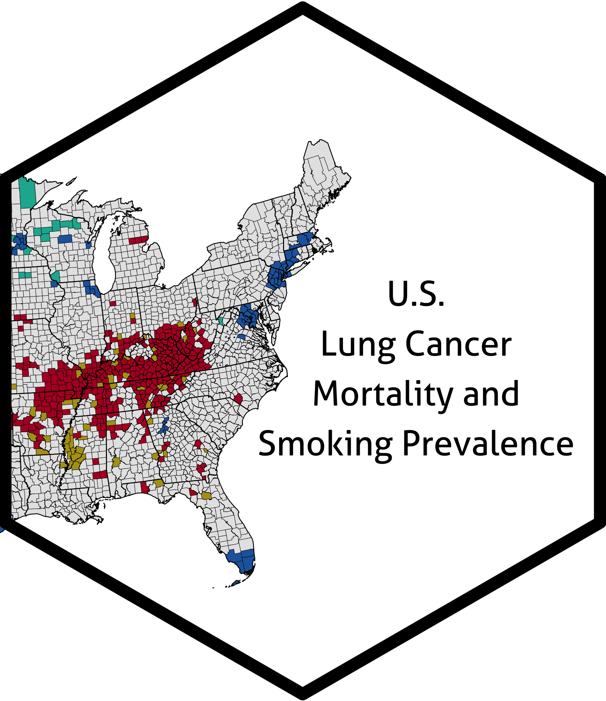

Geographic Patterns in U.S. Lung Cancer Mortality and Cigarette Smoking 
===================================================

### R Scripts Included In This Repository

This repository includes R scripts use to calculate the Lee's L statistic and render the geographic visualizations found in the following peer-reviewed manuscript:

Shreves AH, Buller ID, Chase E, Creutzfeld H, Fisher JA, Graubard BI, Hoover RN, Silverman DT, Devesa SS, Jones RR. Geographic Patterns in U.S. Lung Cancer Mortality and Cigarette Smoking. _Cancer Epidemiology, Biomarkers & Prevention_ (Submitted)

<table>
<colgroup>
<col width="20%" />
<col width="80%" />
</colgroup>
<thead>
<tr class="header">
<th>R Script</th>
<th>Description</th>
</tr>
</thead>
<tbody>
<td>
<code>functions.R</code></td>
<td>Custom functions to calculate the local Lee's L statistic with correction for multiple testing</td>
</tr>
<td>
<code>preparation.R</code></td>
<td>Calculate the local Lee's L statistics for the four comparisons. Requires a data set to run (not included; see notes within). </td>
</tr>
<td>
<code>figure1.R</code>
</td>
<td>Generate Figure 1</td>
</tr>
<td>
<code>figure2.R</code>
</td>
<td>Generate Figure 2</td>
</tr>
<td>
<code>supplemental1.R</code>
</td>
<td>Generate Supplemental Figure 1</td>
</tr>
<td>
<code>supplemental2.R</code>
</td>
<td>Generate Supplemental Figure 2</td>
</tr>
</tbody>
<table>
